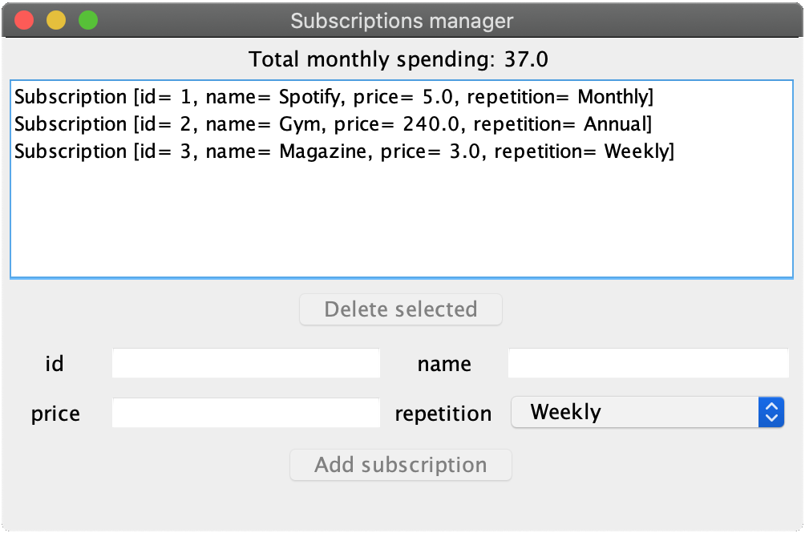
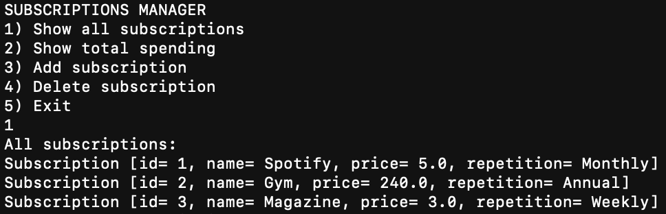

# SubscriptionsManager

A simple Java application to keep track and have an overview of subscriptions and their costs. Built using test driven development (TDD) with Java and Maven. It can be used through a GUI or a CLI interface.

## Screenshots

## Requirements

* Java (Tested on Java 11, 9, 8)
* Docker
* Maven

## Arguments

Argument | Description
---------|-------------
--mongo-host | MongoDB host address. Default value: `localhost`
--mongo-port | MongoDB host port. Default value: `27017`
--db-name | Database name. Default value: `subscriptionsmanager`
--db-collection | Collection name. Default value: `subscriptions`
--ui  | User interfaces options (`gui`, `cli`). Default value: `gui`

## Test

You can run all the **tests** (Unit, Integration and E2E) for this app cloning the repo and executing the command:

`mvn clean verify`

alternatively you can execute the **jacoco 100% coverage check** with:

`mvn clean verify -P coverage-check`

or you can execute **mutation testing** pit with:

`mvn clean verify -P mutation-testing`

## Run the app

Before using the app run **MongoDB** in a container, specifying port, with the command:

`docker run -p 27017:27017 --rm mongo:4.2.3`

To build the **fat JAR** package through the command

`mvn clean package` or alternatively you can download the JAR directly from [here](https://github.com/pzsette/SubscriptionsManager/releases)

Start the app with

`Java -jar -target/subscriptionsmanager-0.0.1-SNAPSHOT-jar-with-dependencies.jar [arguments]`
