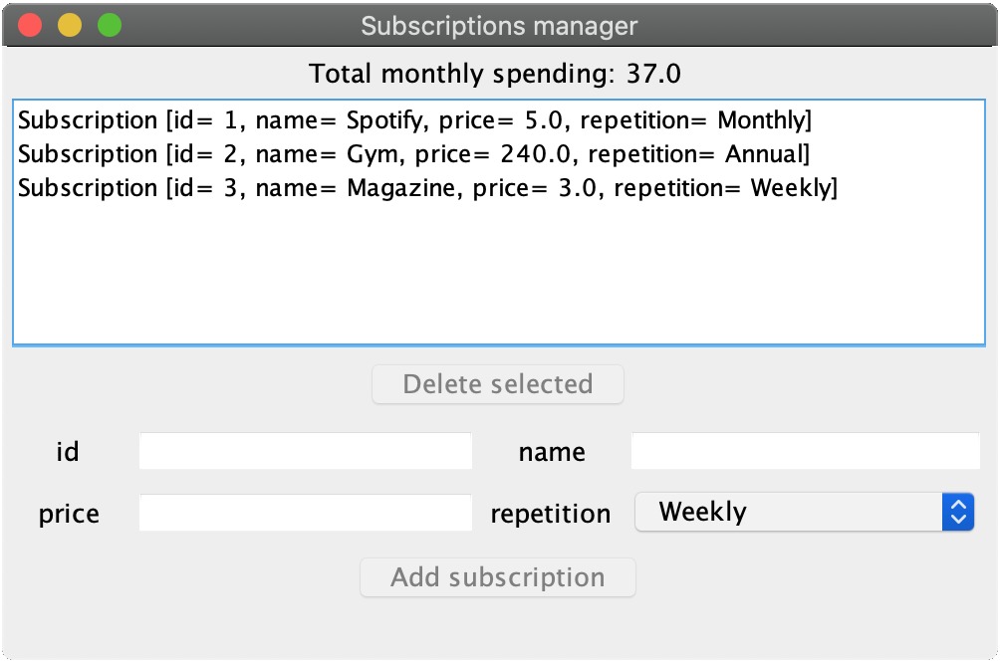
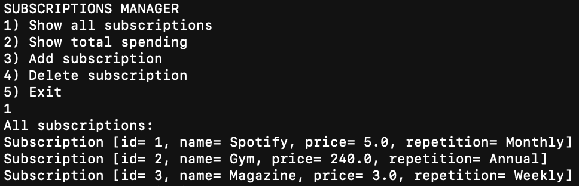

# Subscriptions Manager

## Introduction

This project is a simple application built using the Test-Driven Development (**TDD**) methodology together with **Build Automation** and **Continuous Integration** services. This application allows a user to store informations about different subscriptions and track the monthly spending for all of them.

## Application features

The applications itself is quite simple, the features are:

* Add a new subscription to the database. Every subscription has an id, a name a price and a repetition.
* Remove a subscription from the database
* Compute and show the monthly spending overall for all the subscriptions.

The user can interact with the application in two different ways: 

* **GUI** (Graphic User Interface)
* **CLI** (Command Line Interface)

## Used technologies

Here below are listed all the technologies and tools used to make this application.

### Development tools

* **Operating Sistem**: macOS Catalina 10.15.7
* **IDE**: Eclipse 4.7.0
* **Programming language**: Java 11

### Version control

* **Git**: distributed version-control system for tracking changes in every kind of file.
* **GitHub**: provider for software development and version control using git.

### Database

* **MongoDB**: NoSql and document-oriented database program.
* **Docker**: tool designed to make it easier to create, deploy, and run applications by using containers .

### Build Automation

* **Maven**: build automation tool used primarily for Java projects.

### Testing

* **JUnit**: open source Unit Testing Framework for JAVA.
* **AssertJ**: provides a rich set of assertions to improves test code readability
* **AssertJSwign**: Java library that provides a fluent interface for functional Swing UI testing.
* **Mockito**: framework which can be used in conjunction with JUnit. Mockito allows to create and configure mock objects.
* **Testcontainer**:  Java library that supports JUnit tests, providing lightweight, throwaway instances of common databases.

### Code Quality

* **SonarQube**: platform for continuous inspection of code quality to perform static analysis of code to detect bugs, code smells, and security vulnerabilities.
* **SonarCloud**: SonarQube instance in the cloud. It offers free continuous code quality analyses and also decorates pull requests on GitHub.

## Implementation

The whole application is based on the **MVC** Model-View-Controller) patter. To be precise we used the MVP a slightly variant of the MVC. 

### Model

This class represents a subcription instance. It has four attributes: id, name, price and repetition. The repetition field is a `String` and can assume three values: `"Weekly"`, `"Monthly"`, `"Annual"`. This class contains all the getter/setter and the mothods ```equals```, `toString`, `equals`.

### Controller

The Controller acts as a bridge between the view and the model. It retrieves data from the repository (the model) and formats it into for dispaly in the view. The ```SubscriptionController``` class obviously has a reference to a View object and to a Repository object. It has three methods to:

* Load alla elements into the view from the repository.
* Update the view when a new Subscrition in added.
* Update the view when a Subscription in delete.

### Repository

The repository interface provides methods for simple operations on the database.

The `SubscriptionMongoRepository` class implents this interface to use a MongoDB database. The constructor takes a `MongoCLient` object, the database and the repository name.

To avoid having to manually convert Subscription objects into Mongo documents it was added the POJOs (Plain Old Java Object) support via the PojoCodec, wich allows for direct serialization of POJOs to and from BSON.

Automatic POJO support can be provided by building `PojoCodecProvider` by calling `builder.build()` then it can be combined with an existing `CodecRegistry` to create a new registry that will also support the registered POJOs.
After creating the codec registry, the model type must be passed to the `getCollection` method in `MongoDatabase`, and the registry can then be added using the `withCodecRegistry` modifier of `MongoCollection`.

```
public SubscriptionMongoRepository(MongoClient client, String dbName, String collectionName) {
	
	CodecRegistry pojoCodecRegistry = fromRegistries(MongoClientSettings.getDefaultCodecRegistry(),
			fromProviders(PojoCodecProvider.builder().automatic(true).build()));
	
	collection = client
			.getDatabase(dbName)
			.getCollection(collectionName, Subscription.class)
			.withCodecRegistry(pojoCodecRegistry);		
}
```	
### Compute Spending

The `SubscriptionSpending` class is used to computer the mothly spending amount. It has only one static method `computeSpending` that takes as input `Lis<Subscrption>` and returns the spending as double.

```	
public static double computeSpending(List<Subscription> subs) {
	Double price = 0.0;
	for(Subscription sub : subs) {
		if (sub.getRepetition().equals("Weekly")) {
			price += sub.getPrice()*4;
		} else if( sub.getRepetition().equals("Monthly")) {
			price += sub.getPrice();
		} else {
			price += sub.getPrice()/12;
		}
	}
	return price;
 } 
```	
The beahaviour of this function is tested in the 
`SubscriptionMongoRepositoryTest` class.
 

### Docker Virtualization

Usually installi a server directly on the development machin is a bad idea, infact this can cause issues durign configuration among all tem's members. **Docker** containers are used with aim of virtualize the mongoDB server for this application.
The main advantage of containers is the high reproducibily, so every one can use the same version of the server.
The following command allows to start a MongoDB container, from the image, on the port *27017*:

`docker run -p 27017:27017 --rm mongo:4.2.3`

During integration and e2e tests MongoDB is configured and launched trough the **Testcontainer** Java library. 

### View
The generic view interface provides methods for loading and deleting methods and showing error messages. This application offers to the user to choose between two different UIs.

#### GUI
The GUI view is build using the Swing framework. Most of the work was done through the Window Builder tool. 



The `updateAmountLabel()`
method is responsable for updating the spending label whenever necessary using the static `computeSpending(List<Subscription>)` method of the `SubscriptionSpending` class.
 
#### CLI



Since there are no tools for testing CLI-based application it was necessry to find a workaround to do that. All the functios print to ```System.out``` , so we can capture that output changing it with a different ```PrintStream```. In particular if change ```System.out``` with ```ByteArrayOutputStream```, the we can capture the output as a ```String```. Using **Dependancy Injection** we can create a different ```SubscriptionViewCLI``` instance depending if we're testing or executing the app.

```
public class SubscriptionViewCLI implements SubscriptionView {
	
	private List<Subscription> listSubscriptions; 
	
	private Scanner scanner;
	private PrintStream output;
	
	public SubscriptionViewCLI(PrintStream output) {
		this.output = output;
		listSubscriptions = new ArrayList<>();
	}
	
	/* ... */
}
```

The function `runApp()` set scanner attribute, show the initial menu and then depending on the user's choice call the appropriate function.

``` 
public void runView() {
	scanner = new Scanner(System.in);
	output.println("SUBSCRIPTIONS MANAGER");
	boolean exit = false;
	while (!exit) {
		showOptions();
		int choice = forceDigitChoice(1, 5);
		switch(choice) {
		case 1:
			showSubscriptions();
			break;
		case 2:
			showSpending();
			break;
		case 3:	
			addSubscription();
			break;
		case 4:
			deleteSubscription();
			break;
		case 5:
			exit = true;
			break;
		default:
			break;
		}
	}
	output.println("Goodbye!");
}
``` 

The functions `forceDoubleChoice()` and `forceDigitChoice(int low, int high)` ensure that the user chooses only allowed values.

## Testing

The application is fully tested and the **pyramid** shape is respected:

* 50 Unit tests
* 18 Integrations tests
* 10 End to End tests

### Unit tests

In this phase every class is tested in isolation. The **Mockito** library was used to mock the other components that get involved.

Unit tests are stored in the *src/test/java* folder.

To simulate input by the user during the test of the CLI version of application was used the `System.setIn()` method that reassigns the "standard" input stream. This can be a `ByteArrayStream`, so we use a string, encoded into a sequence of bytes, as custom input.

```
@Test
public void testLoadAllSubscriptions() {
	cliView.loadAllSubscriptions(asList(SUBSCRIPTION_FIXTURE,SUBSCRIPTION_FIXTURE2));
	String input = "1"+EOL+"5";
	System.setIn(new ByteArrayInputStream(input.getBytes()));
	assertThat(cliView.getList())
		.containsExactly(SUBSCRIPTION_FIXTURE,SUBSCRIPTION_FIXTURE2);
}
```

JUnit is the main framework used for testing, together with AssertJ and AssertJ Swing (for UI tests)

### Integrations tests

Integrations tests verify the correct behaviour of some components together and when interacting with external servicie. In this case the MongoDB database are started by **Testcontainer**, a Java library that provides throwaway instances of different database types.

Integrations tests are stored in the *src/it/java* folder.

In particular were tested interactions between, only in the positive or most interesting cases:

* Controller with a real SubscriptionRepository implementation. View is still mocked.

* SubscriptionMongoRepository interacting with a real mongoDB instance.

* Interaction between both types of view and the controller and a real repository.

### End To End tests

In end to end tests the whole application is tested and is verified that all components interacts correctly.

Integrations tests are stored in the *src/e2e/java* folder.

All the tests interact only with the user interface of the application and they're launched from the `main` method in `SubscriptionManagerApp` class.

When testing the GUI view, the application is started using the AssertJ Swing API of the class ApplicationLauncher. Then the API of WindowFinder is used to lookup the frame of ourview by title.

When testing the CLI view a different approach is used. The `ProcessBuilder` class is used to create a new process directly for the JAR file. The output stream is redireted into a `BufferReader` and `BufferWriter` is used to simulate an input from the user.

With end to end tests is verified if:

* All elements are correctly loaded at the startup and the spending amout is correctly computed.

* Addition and Removal of a subscription is done correctly and the spending amount is correctly updated.

* Error messages are correctly shown.


### Code coverage

Using **JaCoCo** we can verify that 100% coverage is achived.
The classes without logic were excluded from coverage measure, throught configuration in the `pom.xml` file.
More precisely were exclued the `Subscription` model class and the `SubscriptionManagerApp`, that contains the main method.

To enable the 100% coverage the following profile is available:

`mvn clean verify -P coverage-check`

### Mutation testing

Also mutation testing is used in this project usnig the **PIT** library. In the pom file mutators are configured to STRONGER level and the mutation threshold is set to 100. Also in this case some classes are excluded.

To enable the mutation check the following profile is availble:

`mvn clean verify -P mutation-testing`


### Continous integration

In this project the GitHub action service is used for continous integrations.
The execution is configured in the maven.yaml file inside the *.github/workflows* folder. The syntax follow the official GitHub documentation.

Basically workflow is made by two branches:

* The first one is executed for every push request on the repository and the eviroment is Java11 on a Ubuntu machine. The *.m2* Maven folder and the *.sonar/cache* folder are cached to improve execution time. Then the maven command is executed to perform:
	1. Build and test the project
	2. JaCoCo coverage
	3. PIT mutation
	4. Coveralls report 
	5. SonarCloud analysis

* The second one is executed after merging a Pull request and runs the same job on two differents Java enviroments: 8, 9.
In this case the maven command performs:
	1. Build and test
	2. JaCoCo coverage
	3. PIT mutaiton

```
name: Java CI with Maven

on: [push]

jobs:
  build:

    runs-on: ubuntu-18.04

    name: Test on Java13

    steps:
    - uses: actions/checkout@v2
      with:
        fetch-depth: 0
    - name: Set up JDK 11
      uses: actions/setup-java@v1
      with:
        java-version: 11
    - name: Cache Maven packages
      uses: actions/cache@v2
      with:
        path: ~/.sonar/cache
        key: ${{ runner.os }}-m2-${{ hashFiles('**/pom.xml') }}
        restore-keys: ${{ runner.os }}-m2
    - name: Run with Maven
      run: |
          xvfb-run --server-args="-screen 0, 1280x720x24" -a \
          mvn -B -f pom.xml clean verify \
          $ENABLED_PROFILES $ADDITIONAL_MAVEN_ARGS \
          -D repoToken=$COVERALLS_TOKEN \
          -D sonar.host.url=$SONAR_URL \
          -D sonar.organization=$SONAR_ORGANIZATION \
          -D sonar.projectKey=$SONAR_PROJECT
      env:
      
      /* ... */

  build-on-pr-merge:
    if: startsWith(github.event.head_commit.message, 'Merge pull request')

    runs-on: ubuntu-18.04
    strategy:
      matrix:
        java: [8, 9]
    name: Test on older Java versions

    steps:
    - uses: actions/checkout@v2
      with:
        fetch-depth: 0
    - name: Set up Java${{matrix.java}}
      uses: actions/setup-java@v1
      with:
        java-version: ${{matrix.java}}
    - name: Cache Maven packages
      uses: actions/cache@v2
      with:
        path: ~/.m2
        key: ${{ runner.os }}-m2-${{ hashFiles('**/pom.xml') }}
        restore-keys: ${{ runner.os }}-m2

    /* ... */

```

## Code quality

#### SonarCube

It's possibile too perform a code quality analysis locally running a Docker Container using the **sonarqube Docker image**, then: 

`mvn clean verify sonar:sonar`

#### SonarCloud

It's also possibile enable code quality analysis on **SonarCloud** specifying the right arguments in the Maven command:

```
mvn clean verify sonar:sonar \
-D sonar.host.url=$SONAR_URL \
-D sonar.organization=$SONAR_ORGANIZATION \
-D sonar.projectKey=$SONAR_PROJECT
```


## Execution

To start the application from the **JAR** with the right paraments we used **picocli**, a framework for creating Java command line applications with almost zero code. Using its annotation the following arguments were specified:

Argument | Description
---------|-------------
--mongo-host | MongoDB host address. Default value: `localhost`
--mongo-port | MongoDB host port. Default value: `27017`
--db-name | Database name. Default value: `subscriptionsmanager`
--db-collection | Collection name. Default value: `subscriptions`
--ui  | User interfaces options (`gui`, `cli`). Default value: `gui`

Is possible to build the **fat JAR** package through the command 

`mvn clean package` 

or alteratively you can download the **JAR** directly from [here](https://github.com/pzsette/SubscriptionsManager/releases)

Start the app with:

`Java -jar -target/subscriptionsmanager-0.0.1-SNAPSHOT-jar-with-dependencies.jar [arguments]` 
